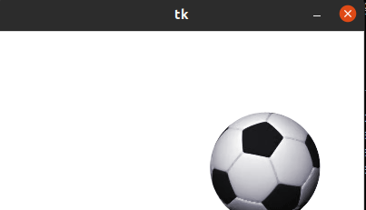

# 3 posicionamiento y diseño y movimiento

## ARC (pacman)
### Este es como pacman pero con movimiento

## CIRCULO 
### Esta pelota hace rebotes en forma de 8 pero tiene igual movimiento para una sola direccion 

## PELOTA
### Esta pelota hace movimientos y rebotes pero para cualquier lado 

## POLIGONO
### Este tiene en forma de corbatin pero no tiene movimiento

## ARCO
### Este arco puede medir angulos de 360 grados 

## RECTANGULO
### Este es un rectangulo una figura que tiene 2 lados iguales y 2 lados anchos 

## TEXT
### cuando acercamos el mouse al texto este automaticamente cambia de color a rojo para haci detecta un color diferente al texto
